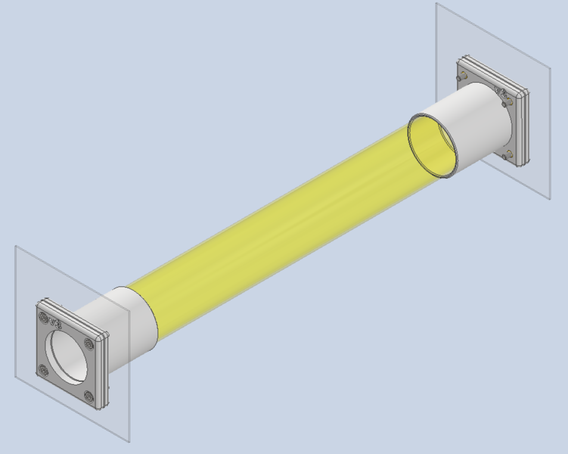

# Cage connector

### Materials
| | |
| - | - |
| cage_inside_01 | 3D printed |
| cage_outside_01 | 3D printed |
| Screws (x4) | M3 x 10 |
| M3 heat-set inserts (x4) |  |

### Assembly instructions

Use step drill bit for holes in plastic cage.  

(x1) 1-1/8" hole for tube  
(x4) 3/16" holes for M3 screws