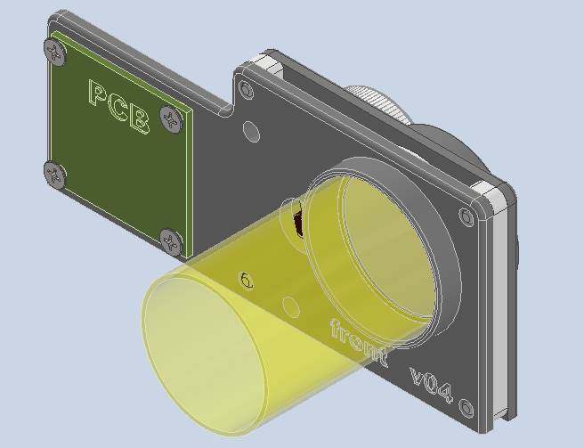

# Door mechanism

## v02

Smaller/asymmetric profile to minimize visual obstruction  
Motor attached to back piece to avoid collision with RFID reader

*Note:* not the final design, still need to debug positioning of center piece

Control instructions found [here](../Door)

### Materials
| | |
| - | - |
| door_03               | 3D printed |
| door_back_04          | 3D printed |
| door_center_03 (x2)   | 3D printed |
| door_front_04         | 3D printed |

| | |
| - | - |
| Mounting screws (x4)  | M3 x 0.5, 10mm |
| PCB screws (x4)       | M3 x 0.5, 6mm |
| Motor screws (x2)     | M3 x 0.5, 4mm |
| M3 x 0.5 heat-set inserts (x10) | [93502A111](https://www.mcmaster.com/93502A111/) |
| Stepper motor kit | [28BYJ-48](https://www.amazon.com/ELEGOO-28BYJ-48-ULN2003-Stepper-Arduino/dp/B01CP18J4A?th=1)|