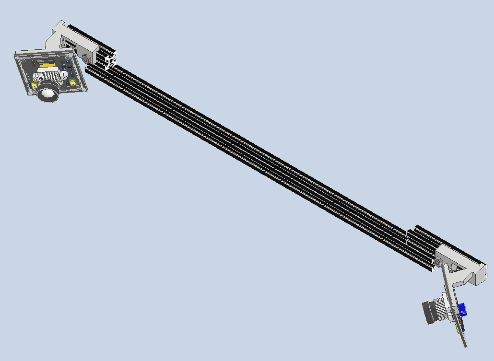

# CAD files for Homecage components

2 cages are connected to each other via the cage connector and a plastic tube.

RFID holders (x2) are mounted onto the plastic tube.

Cameras are mounted at each corner of each cage (x4 per cage)(camera_mount_angled).

Cameras (x2) are mounted facing the plastic tube (mount_flat).

## Cage connector

## RFID holder

## Camera mount
