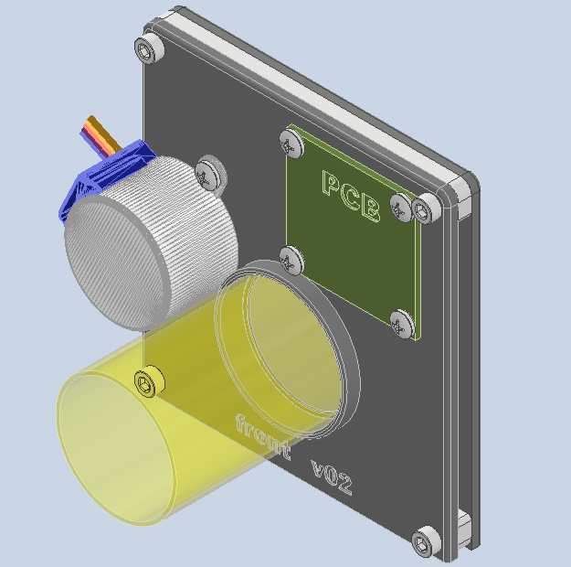
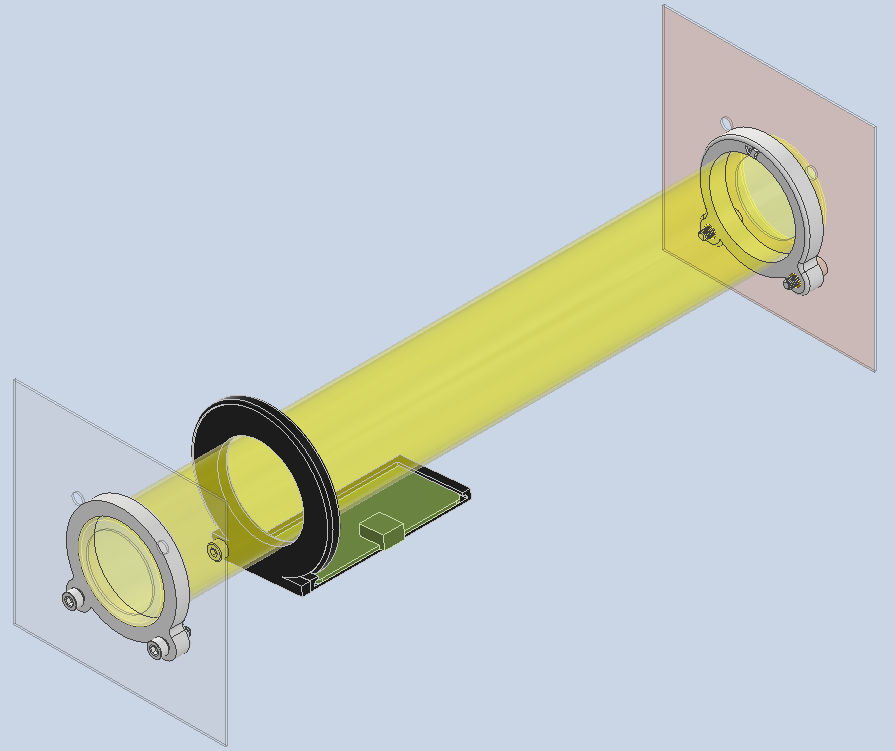
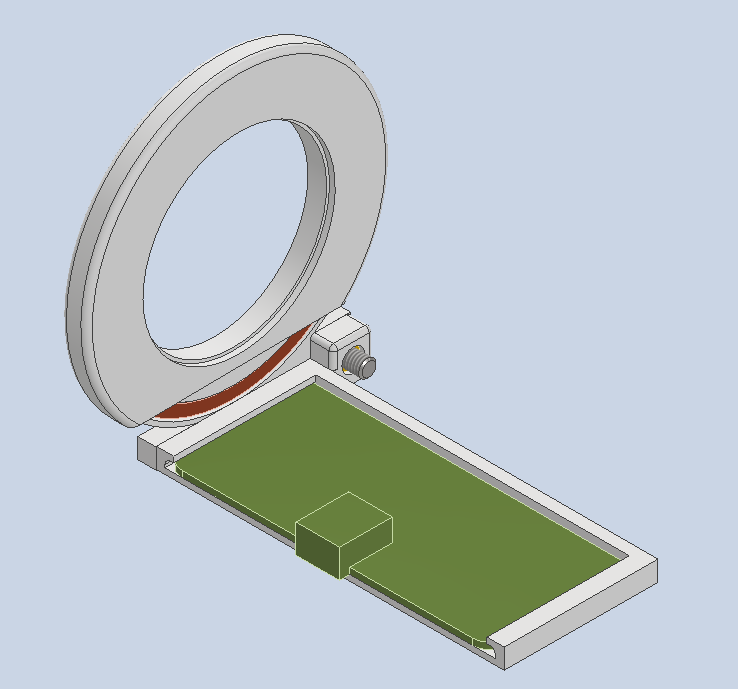

# CAD files for Homecage components

2 cages are connected to each other via the cage connector and a plastic tube.

RFID holders (x2) are mounted onto the plastic tube.

Cameras are mounted at each corner of each cage (x4 per cage)(camera_mount_angled).

Cameras (x2) are mounted facing the plastic tube (mount_flat).

## [Door mechanism](Door)
  
Door is operated by using [door_script_01.ino](../Door/door_script_v01/) (initial draft)

## [Cage connector](Cage_connector)

## [RFID holder](RFID_holder)

## [Camera mount](Camera_mount_angled)
